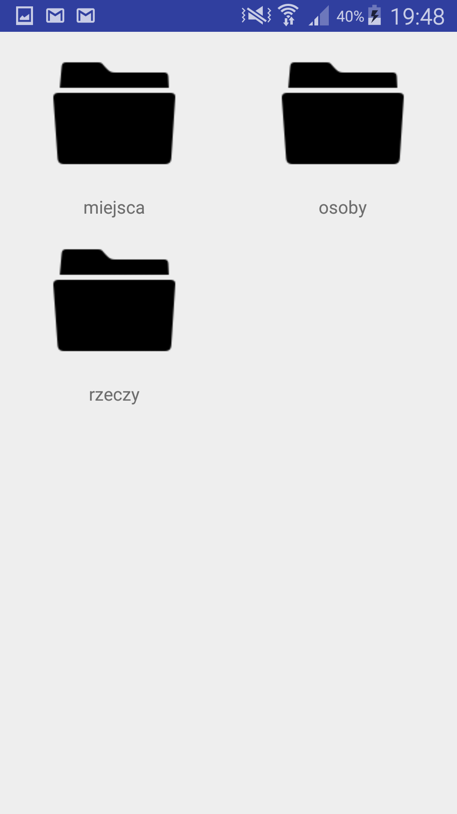

# java-android-app
## przydatne skróty
[pliki z layoutem tutaj](https://github.com/thezapalsky/java-android-app/tree/master/app/src/main/res/layout) 

[pliki z klasami tutaj](https://github.com/thezapalsky/java-android-app/tree/master/app/src/main/java/com/example/mikosz/projektkoncowyzapalskimikolaj)

[plik .apk do instalacji na androidzie tutaj](https://github.com/thezapalsky/java-android-app/blob/master/app-debug.apk)

## kilka screenów

