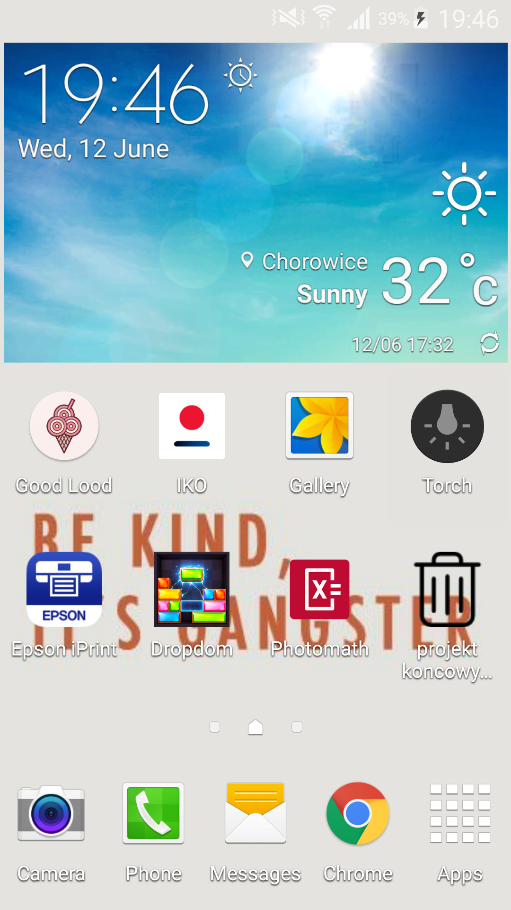

# java-android-app
Projekt robiony przez jedna osobe
## Przydatne skróty
* pliki z layoutem [tutaj](https://github.com/thezapalsky/java-android-app/tree/master/app/src/main/res/layout)
* pliki z klasami [tutaj](https://github.com/thezapalsky/java-android-app/tree/master/app/src/main/java/com/example/mikosz/projektkoncowyzapalskimikolaj)
* plik .apk do instalacji na androidzie [tutaj](https://github.com/thezapalsky/java-android-app/blob/master/app-debug.apk)

## Kilka screenów z dzialania aplikacji

*Logo aplikacji na telefonie z Androidem*

*Menu glowne aplikacji*

*Menu wybierania folderu docelowego*

*Podglad aparatu*

*Mozliwosc zmieniania opcji w kamerze np. zmiana kolorystki*

*Przykladowo na negatyw*

*Z poziomu aplikacji mozemy rowniez przegladac zdjecia jak w galerii*

*Przyklad 1*

*Przyklad 2 (widzimy zrobione przez nas wczesniej zdjecie)*

*""grafiki koncepcyjne"" na funkcje tworzenia kolazu (TBA)*

*Dodawanie zdjec do kolazu*
